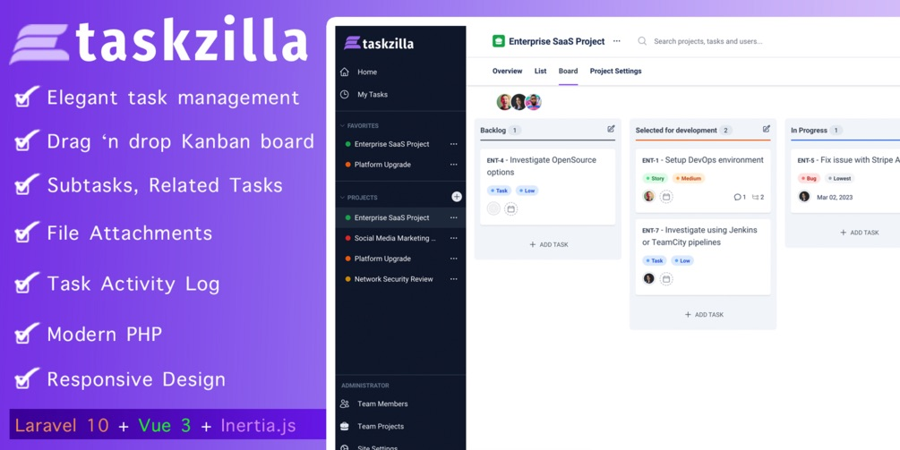

## TaskZilla
Simple Task Management Application written in Laravel + Vuejs (Inertia.js).
Think of it as a Lite, non-SaaS version of Asana. Some features include:
- Modal routing in Inertia.js
- Drag and drop Kanban board
- Support for Subtasks
- Support for Task dependency (eg blocked by, is duplicated by, etc)
- Use of Clean Code - Actions, Pipelines, Data Transfer Objects, etc
- File attachments
- Task Activity Log
- Click-through installer

